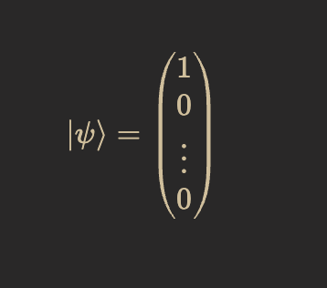
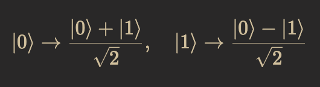
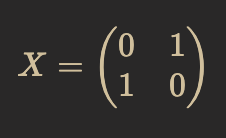
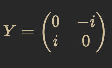
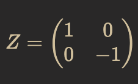
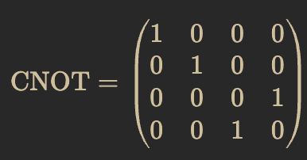

# Pure Quanta

**Pure Quanta** is a basic quantum computer simulation written in pure C. This project simulates qubits using state vectors of complex numbers and implements a few fundamental quantum gates, including the Hadamard gate, Pauli-X, Pauli-Y, Pauli-Z, and the CNOT gate.

> **Note:** This project is in very early alpha. The code serves as a foundation for simulating quantum operations on qubits. Future updates will add features such as quantum measurement, additional gates, circuit composition, and performance improvements.

## Features

- **Qubit Representation:**  
  Uses an array of `Complex` structures (with double-precision real and imaginary parts) to represent the quantum state of a system of qubits. The state vector for an *n*-qubit system is a complex vector of size \($2^n$\).

- **Initialization:**  
  Initializes the system to the \($|0\cdots$ $0\rangle$\) state. In mathematical notation, the initial state is:
  

- **Quantum Gates:**  
  - **Hadamard Gate:** Creates superposition by transforming:
        - 
  - **Pauli Gates:**  
    - **Pauli-X:** Flips \($|0\rangle$\) and \($|1\rangle$\):
        - 
    - **Pauli-Y:** Applies a phase shift and flips states with \($\pm i$\) factors:
        - 
    - **Pauli-Z:** Flips the phase of the \($|1\rangle$\) state:
        - 
  - **CNOT Gate:** A two-qubit gate that flips the target qubit if the control qubit is in the state \($|1\rangle$\). Its matrix representation in the computational basis is:
    - 

## Getting Started

### Prerequisites

- A C compiler (such as `gcc` or `clang`).
- Standard C libraries.

### Compilation

To compile the program, run:

```bash
make
```

### Running the Simulation

After compiling, run the executable with the number of qubits as a command-line argument. For example, to simulate a system with 4 qubits:

```bash
./pure-quanta 4
```

The program will initialize the state vector and print the complex amplitudes for each basis state.

## Code Overview

- **Initialization (`init`):**  
  Allocates memory for the state vector (of size \($2^n$\) for *n* qubits) and initializes the state to \($|0\cdots$ $0\rangle$\).

- **Gate Functions:**  
  Each single-qubit gate (Hadamard, Pauli-X, Pauli-Y, Pauli-Z) takes three parameters: the state vector, the total number of qubits, and the target qubit index. Internally, each function calculates index pairs corresponding to the target qubit’s 0 and 1 states and updates the state according to the gate's matrix.  
  The CNOT gate operates on a control qubit and a target qubit, swapping state amplitudes as needed.

- **Main Function:**  
  Processes the number of qubits from the command line, initializes the state, applies example gates (if enough qubits are provided), prints the state vector, and cleans up allocated memory.

## Future Enhancements

- **Quantum Measurement:** Implement measurement operations with probabilistic state collapse.
- **Additional Gates and Circuits:** Add support for more complex gates and gate combinations.
- **Error Handling and Unit Testing:** Develop automated tests to verify state transformations and circuit behavior.
- **Performance Optimizations:** Optimize memory and computation for larger qubit counts.

## Disclaimer

This project is a work in progress and intended for educational and experimental purposes. Contributions and feedback are welcome as the project evolves.